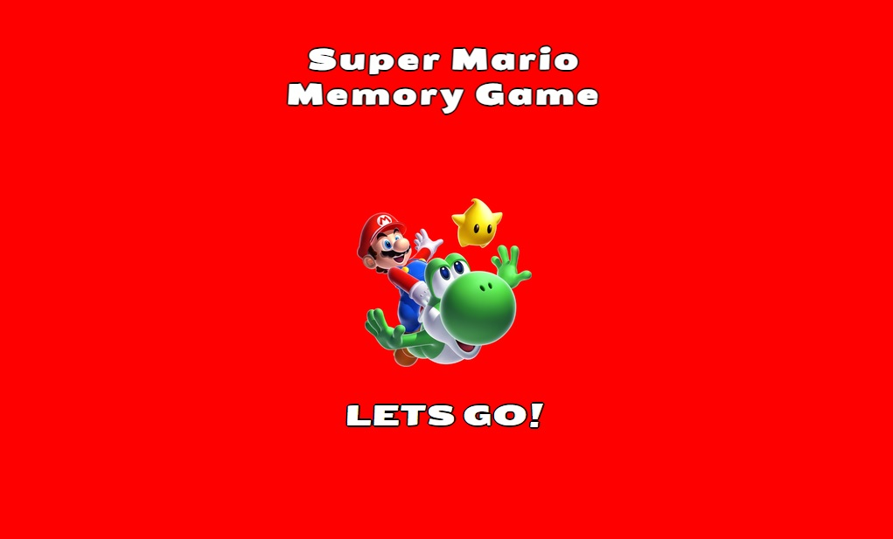

# Welcome to my second project

## SUPER MARIO - THE MEMORY GAME

### PURPOSE

---

 My first thought when starting this project was to make a fun and easy game for my two toddler boys who love Super Mario at the moment. And what game can be better then a memory game that includes pictures of different creatures from the Super Mario game. A memory game fits everyone who wants to train their memory and speed skill. Both kids and adults can play due to its easy design and mecanics. The user need to find two pictures of the same creature to score a point. The game got a timer that starts as soon as you press "play". The user can also pause the game at the same button that says "play" at the beginning of entering the page. As soon as you press "play" the button changes to "stop game" and the user can deside to pause the game when they need to. The timer continues to count until the user have found all the matching cards. The game also got a "moves" tracker who shows how many moves a user has taken during the game.  

### UX DESIGN

---

#### USER STORIES

- #### As a first time user

  - I want to be intriged to play the game
  - I want to feel amused by the game
  - I want to feel exited when playing the game
  - I want a break from everything else around me and get a quick brain workout
  
- #### As a returning and frequent user

  - I want to get a break and get a quick brain workout
  
#### All users are enabled to play both on the computer and on their mobile phones

### STRUCTURE

---

#### STARTING PAGE

- The first page a user enters is the starting page. It has the heading text "Super Mario Memomry Game" and a picture of Mario riding on Yoshis back with a little star friend next to them.

#### GAME AREA PAGE

- The game area contains the memory game. It got 12 different cards that the user can click on and pair them in order to continue and win the game.

### FEATURES

---

#### STARTING PAGE

- #### HEADING

- The heading text is at the top of the website and contains the text "Super Mario - Memory Game". Its purpose is to make the user understand what type of game it is that they are going to play.

- #### IMAGE
  
- The image of Super Mario on Yoshi is under the heading to make the user understand that the game is about Super Mario

- #### "LETS GO" BUTTON
  
- Under Super Mario and Yoshi is a button that says "Lets go!". If the user click on the button it takes them to the game page.

#### GAME AREA PAGE

- #### MOVES SECTION

  - The memory game has a section that counts how many moves the user does during the game

- #### TIMER SECTION

  - The timer starts as soon as the user press "play" and stops when the player completes or pause the game.

- #### MEMORY CARDS

  - The memory cards is used to play the game. The user click on one to switch the card and then chooses another one in hope that they are the matching pair.
  - The front of the cards is the question block from the Super Mario game.
  - When a user click on one card a creature from the Super Mario game appears.

- #### RESTART BUTTON

- At the bottom of the game area is a restart" button which the user can click on to restart the game.

### COLOR SCHEME

---

- The color scheme through both pages is a #red background and #white text with a #black border around the text. The buttons to start/pause the game got a grey background color.

### TECHNOLOGIES

---

- [https://validator.w3.org/nu/] to validate html code
- [https://jigsaw.w3.org/css-validator/] to validate css code
- [https://freepngimg.com/] for images
- favicon from [https://fontawesome.com/icons/block-question?f=classic&s=duotone&pc=%23dcb218&sc=%23dcb218]
- used [https://favicon.io/favicon-converter/] to generate the favicon
- [https://www.remove.bg/] to remove background from favicon

### WIREFRAMES

---

#### HOME PAGE

### TESTING

---

- I tested the website in Chrome, Firefox and Edge browser to see that all pages loaded and that every link, button, form, image and navigation menu was working
- The site is also responsive which I tested in google chromes devtools by selecting different screensizes and test each function
- I tested that all text is easy to read and to understand
- The code got valified through both CSS and HTML validators

#### BUGS

- when I first deployed this project the images and css code didnt work. the solution was to correct all the pathways to relative ones insted of absolute.

#### LIGHTHOUSE

#### I also tested the website in Lighthouse with the result below

- #### Home Page - Mobile version

- #### Home Page - Desktop version

- #### Safari Gallery Page - Mobile version

- #### Safari Gallery Page - Desktop version

- #### Booking Page - Mobile version

- #### Booking Page - Desktop version

- #### Contact Us Page - Mobile version

- #### Contact Us Page - Desktop version

- #### Booking Page, Thank you Page - Mobile version

- #### Booking Page, Thank you page - Desktop version

- #### Contact Page, Thank you page - Mobile version

- #### Contact Page, Thank you page - Desktop version

### DEPLOYMENT

---
    This project was deployed to Github.com. The following steps shows how you do it:

1. Log in to your Github.
2. Go to the Safari Retreat repository in Github: [https://github.com/Kimskogfelter/Safari-Retreat]
3. Select Settings in the repository navigation menu at the top.
4. Select Pages at the left handside of the website.
5. Choose: Deploy from a branch as Source.
6. Choose: Main as branch and /root as folder and press save.
7. Wait a few minutes and press the Code menu to the top left.
8. At the right handside go to Deployment.
9. Then press the  to go to the live website.

### ISSUES

- The form in the Booking page looks squished together in the firefox browser only. All the other pages looks like they should in firefox, edge and chrome
- The IDE i was working with (Code Anywhere) have been very buggy during this time ive been working with this project. The last two weeks I couldnt see any changes I made unless I commited and pushed to Git. Which have made the project get many commits

### CREDITS

---

#### MEDIA

- [https://www.pexels.com/sv-se/] and [https://pikwizard.com/] for images

#### CODE

- The code for the social media links in the footer are taken from Love Running project. [https://github.com/Code-Institute-Solutions/Love-Running-Solutions.git]
- the media querys comments in css are taken from Love Running project. [https://github.com/Code-Institute-Solutions/Love-Running-Solutions.git]
- used information from the site, [https://stackoverflow.com/questions/50178709/set-my-logo-to-the-left-and-navigation-menu-to-the-right-using-flexbox] to make the toggle navigation menu stick to the right side
- used [https://blog.hubspot.com/website/center-div-css#center-div-css] to center the informations text div
- code for the hero slide was taken from [https://www.youtube.com/watch?v=Ef8LxpRPGRA]
- code for the meta tags for the search engines results are from the Love Running project [https://github.com/Code-Institute-Solutions/Love-Running-Solutions.git]

#### All the thanks to the lovely students on slack for helping out when needed and my tutor Ronan for being so supportive and helpfull
